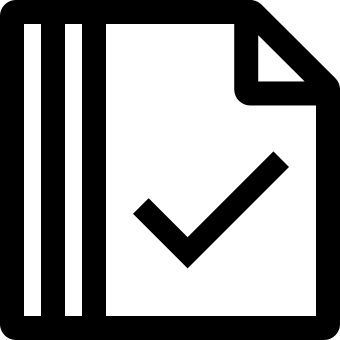
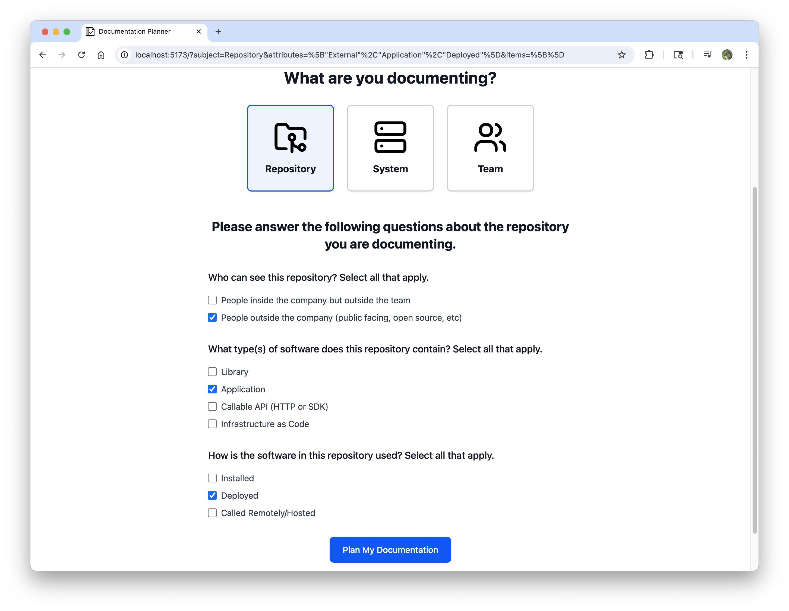
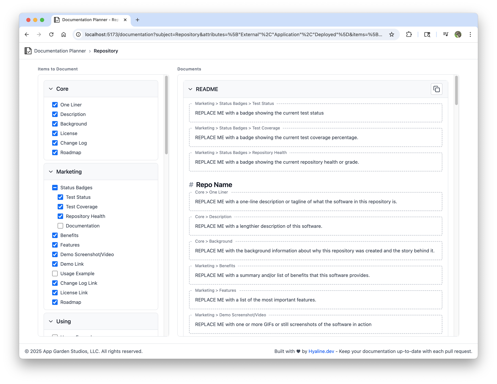

<div align="center">
  <h1> Documentation Planner</h1>
  Identify what to document for your software product team.

   
  <p><a href="https://planner.hyaline.dev">planner.hyaline.dev</a></p>
</div>

The approach this tool takes is to present a superset of items that a software product team should consider documenting for a given subject (e.g repository, system, team). It is not intended that every item should be documented for every subject.

We created this tool because we have had to research and plan out documentation at every single place we worked, and we wanted a reference that we could use. We thought that reference would be helpful to others, so here we are!

## Using
Please visit https://planner.hyaline.dev to use the documentation planner tool.

If you have issues or suggestions please feel free to create a [GitHub issue](https://github.com/appgardenstudios/documentation-planner/issues) or contact us at support@hyaline.dev.

## Developing

### Prerequisites
- Node.js

### Setup
Install dependencies:
```bash
npm ci
```

### Running
Run the development server:
```bash
npm run dev
```

## Testing
There are unit tests for functionality that is not easy to test manually.

### Running
Run tests:
```bash
npm test
```

## Releasing
GitHub pages is configured to pull from the `docs/` folder on the `main` branch. There is a pre-commit hook installed to ensure that the `docs/` folder always contains the built tool on every commit.

### Instructions
Build for production:
```bash
npm run build
```

## Contributing
Suggestions and additions are welcome. Please open an issue to discuss your suggestion or fork and open a PR.

A few things to note:
- This is an opinionated collection, so it is up to us as authors to decide wether or not to accept any changes.
- The software in this repo is licensed under MIT and the content under CC-SA, so any additions or changes will need to be contributed under those licenses.
- Examples and/or usage information must be properly attributed and the source author must allow incorporation into this work.

## License
The content of this tool itself is licensed under the [Creative Commons Attribution 4.0 International license](https://creativecommons.org/licenses/by/4.0/), and the underlying source code used to format and display that content is licensed under the [MIT license](./LICENSE.md).